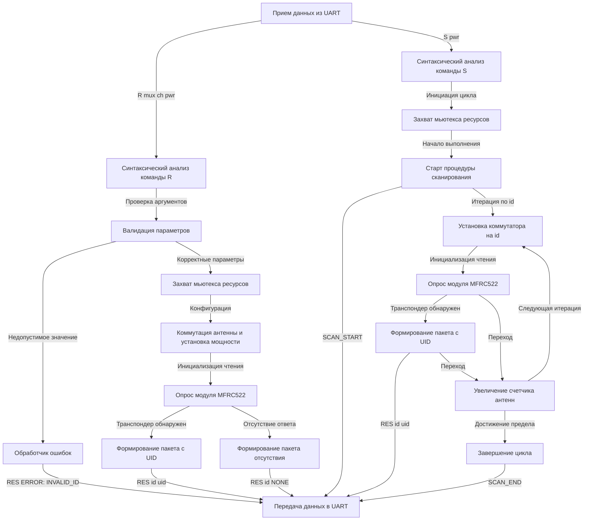

# Система управления матрицей RFID-антенн

## Введение и обзор проекта
Настоящий проект представляет собой специализированное программное обеспечение (прошивку) для микроконтроллера ESP32-S3. Основным назначением системы является управление масштабируемой матрицей, состоящей из 96 RFID-антенн, посредством единственного аппаратного считывателя MFRC522. Управление комплексом осуществляется внешним хостом по последовательному интерфейсу (UART). В основе архитектуры программного обеспечения лежит операционная система реального времени FreeRTOS, что обеспечивает асинхронную обработку команд и параллельное выполнение задач без взаимных блокировок. Особое внимание при разработке уделено вопросам надежности и предотвращения фрагментации оперативной памяти: в критических участках кода полностью исключено динамическое выделение памяти (heap allocations).

## Ключевые архитектурные и функциональные особенности
- **Масштабируемость аппаратной части:** Поддержка до 96 независимых антенн. Коммутация высокочастотных трактов осуществляется за счет использования многоканальных мультиплексоров (8 каналов) и дешифраторов (16 выходов).
- **Режимы функционирования:** Реализована поддержка как точечного опроса конкретной антенны по запросу, так и автоматического циклического сканирования всей матрицы.
- **Работа в реальном времени:** Использование механизмов синхронизации FreeRTOS (в частности, мьютексов) гарантирует потокобезопасный доступ к разделяемым аппаратным ресурсам, таким как шина SPI и интерфейс UART.
- **Оптимизация использования памяти:** Применение статических буферов, стандартной функции `sscanf`, а также последовательного вывода данных через `Serial.print()` минимизирует риск фрагментации кучи, типичный при интенсивном использовании динамических строковых объектов (класса `String`).
- **Регистрация множественных меток:** Внедрение механизма перевода распознанной метки в состояние пониженного энергопотребления (`HaltA`) позволяет считывателю фиксировать до трех различных меток в электромагнитном поле одной антенны за один цикл опроса.

## Аппаратное обеспечение
Для корректного функционирования системы требуется следующая аппаратная база:
- **Вычислительное ядро:** Микроконтроллер ESP32-S3 (в конфигурации `esp32-s3-devkitc-1`).
- **Модуль радиочастотной идентификации:** Считыватель на базе микросхемы MFRC522.
- **Интерфейс связи с хост-системой:** UART (рабочая скорость передачи данных составляет 115200 бод).
- **Матрица антенн:** Специализированная печатная плата, оснащенная каскадами коммутации высокочастотного сигнала.

## Требования к сборке и развертыванию
Проект интегрирован с системой сборки и управления зависимостями **PlatformIO**. Процесс развертывания включает следующие этапы:

1. Установка интегрированной среды разработки (например, VS Code) с официальным расширением PlatformIO.
2. Клонирование репозитория с исходным кодом.
3. Открытие директории проекта в среде PlatformIO.
4. Инициализация процесса сборки (команда `Build`).
5. Программирование flash-памяти микроконтроллера (команда `Upload`).

Необходимые внешние библиотеки, в том числе драйвер `miguelbalboa/MFRC522`, загружаются и линкуются менеджером пакетов PlatformIO автоматически на этапе сборки.

## Протокол обмена данными (интерфейс UART)
Взаимодействие с устройством осуществляется через стандартный последовательный порт на фиксированной скорости **115200 бод**. Обязательным требованием к формату передачи является использование символа переноса строки `\n` в качестве терминатора команд.

### Чтение данных с заданной антенны
Данная команда инициирует точечный опрос антенны с указанным адресом.
**Формат команды:** `R <mux> <ch> <pwr>`
- `<mux>` — индекс мультиплексора (допустимый диапазон: 0-11).
- `<ch>` — индекс канала дешифратора (допустимый диапазон: 0-7).
- `<pwr>` — уровень мощности (усиления) приемопередатчика MFRC522 (допустимый диапазон: 0-7).

**Форматы ответов системы:**
- При успешной идентификации метки (меток): `RES <id> <uid>` (где вычисляемый идентификатор `<id>` = `mux * 8 + ch`, а `<uid>` — уникальный идентификатор метки). При обнаружении нескольких меток ответ формируется в виде нескольких строк соответствующего формата.
- При отсутствии меток в зоне действия антенны: `RES <id> NONE`.
- При некорректных входных параметрах (выход за границы допустимых диапазонов): `RES ERROR: INVALID_ID`.

### Автоматическое сканирование всей матрицы
Команда инициирует последовательное переключение и опрос всех 96 антенн комплекса.
**Формат команды:** `S <pwr>`
- `<pwr>` — уровень мощности (усиления) приемопередатчика (допустимый диапазон: 0-7).

**Форматы ответов системы:**
- Уведомление о начале цикла сканирования: `SCAN_START`.
- Уведомление об успешной идентификации метки: `RES <id> <uid>` (данное сообщение генерируется исключительно для тех антенн, где зафиксировано физическое присутствие транспондера).
- Уведомление о завершении цикла сканирования: `SCAN_END`.

## Архитектура системы и диаграмма потоков данных
Ниже приведена логическая схема, отражающая процесс обработки входящих команд, последовательность взаимодействия внутренних программно-аппаратных компонентов и алгоритм формирования исходящих сообщений.

